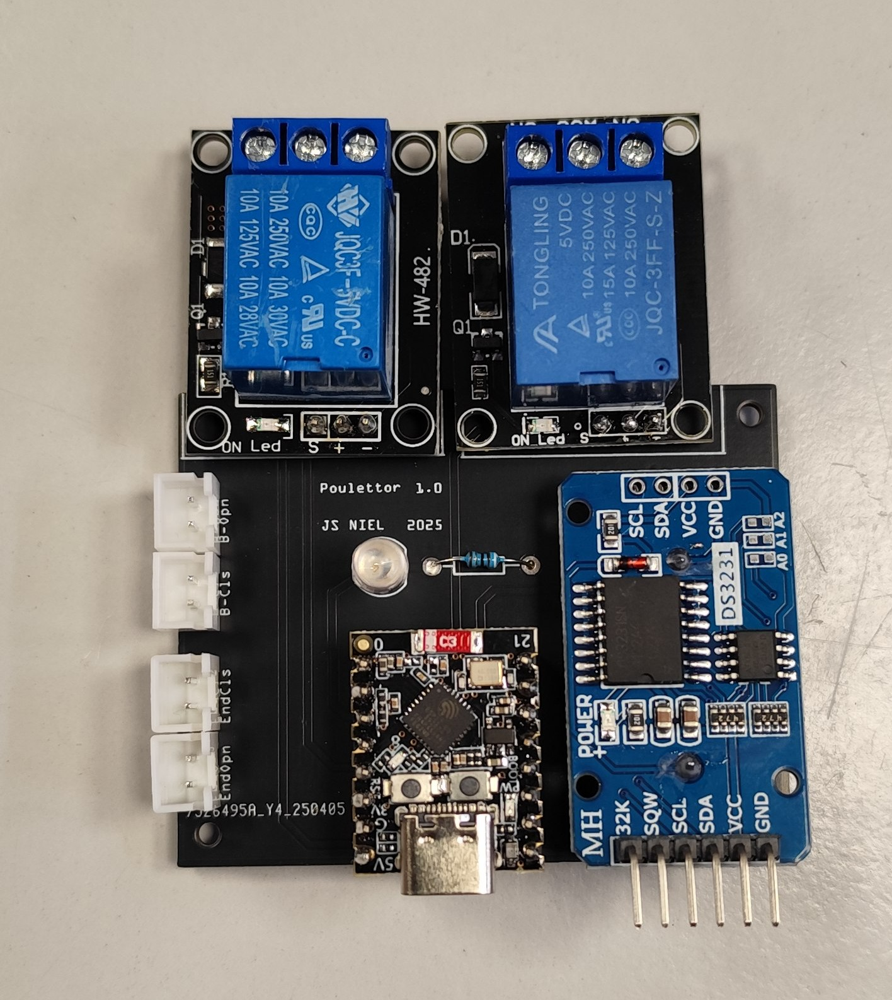
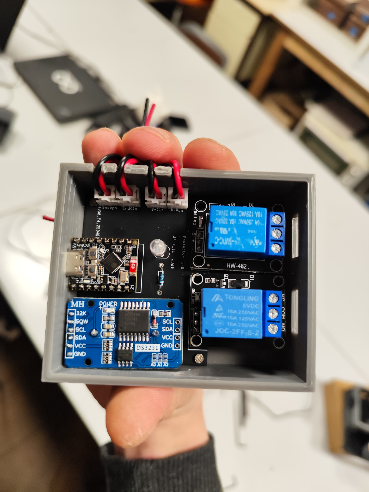
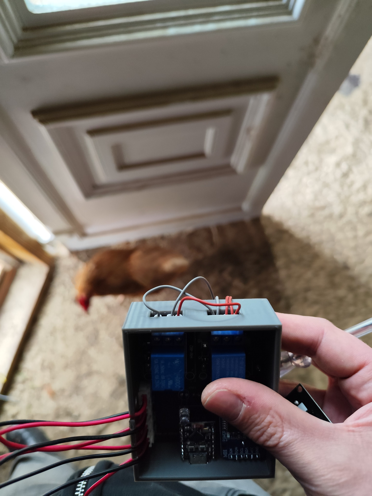
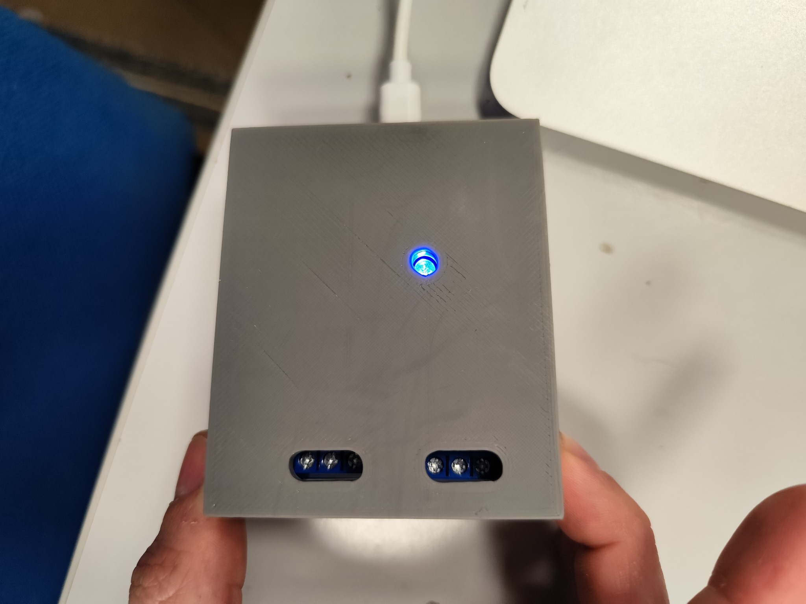
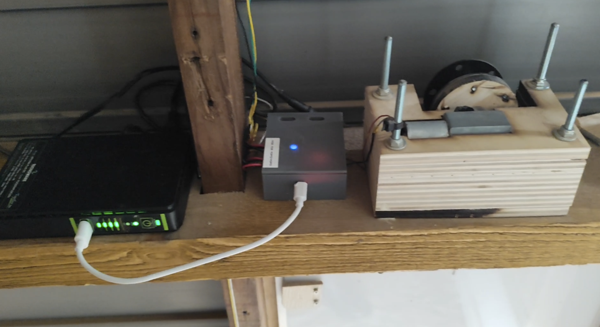
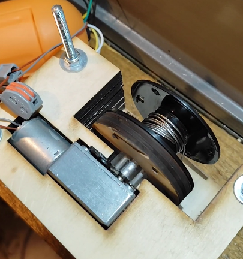
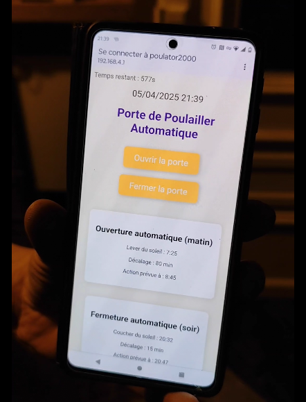

# 🐔 Poulettor

**Open-source automatic chicken coop door controller**

Autonomous ESP32-C3 controller for opening and closing a chicken coop door using a simple DC motor, limit switches and a local Wi‑Fi web interface.

---

## Description

Poulettor is an open-source chicken coop door controller designed to automate a simple sliding or lifting door.

The project uses an **ESP32-C3 Mini**, a **DS3231 RTC**, two relay modules and two limit switches to safely drive a small DC motor in both directions.

Opening and closing times are automatically calculated from local sunrise and sunset, with configurable time offsets from the web interface.

The system is designed to be simple, repairable and independent from the cloud.

---

## Features

- Automatic opening based on sunrise
- Automatic closing based on sunset
- Adjustable morning and evening offsets
- Manual opening button
- Manual closing button
- Local Wi‑Fi configuration portal
- RTC-based scheduling with DS3231
- DC motor control through relays
- Top and bottom limit switch detection
- Motor timeout protection
- Status LED feedback
- No cloud required

---

## Hardware

### Required

- ESP32-C3 Mini
- DS3231 RTC module
- 2 × 5V relay modules
- Small DC gear motor
- 2 × limit switches
- 2 × push buttons
- Status LED + resistor
- Custom PCB or hand wiring
- 5V power source or USB power bank
- Mechanical door, spool, cord and guides

---

## PCB / Electronics

<p align="center">
  
</p>

The current prototype uses a custom PCB marked **Poulettor 1.0**.

Hardware files are available in:

```txt
hardware/
```

---

## Prototype Photos

<p align="center">
  
  
</p>

<p align="center">
  
  
</p>

---

## Door Mechanism

The door is moved by a simple DC motor and spool mechanism.

<p align="center">
  
</p>

Two limit switches are used:

- top limit switch: door fully open;
- bottom limit switch: door fully closed.

The firmware stops the motor when a limit switch is reached or after a safety timeout.

---

## Web Interface

You can:

- open the door manually;
- close the door manually;
- view current RTC date and time;
- view calculated sunrise and sunset times;
- configure morning and evening offsets;
- set the RTC time.

<p align="center">
  
</p>

---

## Buttons and LED

### Open / Wi‑Fi button

A short press opens the door manually.

A long press starts the Wi‑Fi configuration portal.

### Close button

A short press closes the door manually.

### LED behavior

| LED behavior | Meaning |
|---|---|
| Solid ON | Automatic mode available |
| Double blink pattern | Wi‑Fi portal active |
| Slow blinking | RTC error |
| Fast blinking | Motor timeout error |

---

## Wi‑Fi portal

Default access point:

```txt
SSID: poulator2000
Password: nounette
Address: http://192.168.4.1
```

The portal is started with a long press on the open/Wi‑Fi button.

---

## Firmware

Location:

```txt
firmware/PoulettorFW/PoulettorFW.ino
```

---

## Arduino IDE Setup (ESP32‑C3)

### 1. Add ESP32 boards

Open Arduino IDE:

- Go to **File → Preferences**
- In **Additional Boards Manager URLs**, add:

```txt
https://raw.githubusercontent.com/espressif/arduino-esp32/gh-pages/package_esp32_index.json
```

---

### 2. Install ESP32 package

- Go to **Tools → Board → Boards Manager**
- Search: `esp32`
- Install:

```txt
esp32 by Espressif Systems
```

Tested version:

```txt
3.3.5
```

---

### 3. Select board

```txt
ESP32C3 Dev Module
```

---

### 4. Required libraries

Install from Arduino Library Manager:

| Library | Tested version |
|---|---:|
| RTClib by Adafruit | 2.1.4 |
| Adafruit BusIO | 1.17.4 |

---

## Usage

### First boot

1. Power the controller.
2. Hold the open/Wi‑Fi button for about 3 seconds.
3. Connect to the Wi‑Fi access point.
4. Set the RTC time.
5. Configure sunrise and sunset offsets if needed.

---

### Manual control

- Short press on the open button: open the door.
- Short press on the close button: close the door.
- Web interface buttons can also open or close the door.

---

## Known Issues

- No battery level monitoring.
- Wi‑Fi portal has no authentication beyond the AP password.
- Location is currently hardcoded in the firmware.
- The enclosure is a prototype.
- The mechanism must be adapted to each chicken coop door.

---

## BOM

Main components:

- ESP32-C3 Mini
- DS3231 RTC module
- 2 × relay modules
- DC gear motor
- 2 × limit switches
- 2 × push buttons
- LED + resistor
- custom PCB or hand wiring
- 5V power source


---

## 📂 Project Structure

```txt
Poulettor/
├── firmware/
├── hardware/
├── mechanical/
├── docs/
├── LICENSES/
├── README.md
└── LICENSE
```

---

## Author

**Jean-Sébastien Niel**

GitHub:  
https://github.com/jsniel

---

## License

Poulettor uses separate licenses for firmware and hardware.

### Firmware

GNU General Public License v3.0 or later

```txt
GPL-3.0-or-later
```

### Hardware

CERN Open Hardware Licence Version 2 - Strongly Reciprocal

```txt
CERN-OHL-S-2.0
```

---

## ⚠️ Disclaimer

This project controls a moving mechanical door.

Always test the mechanism safely before using it with animals.

Make sure the door cannot injure animals, block unexpectedly, or trap a chicken during closing.

This project is provided without warranty.

---

## Contributing

Pull requests, mechanical improvements, PCB improvements and firmware improvements are welcome.
